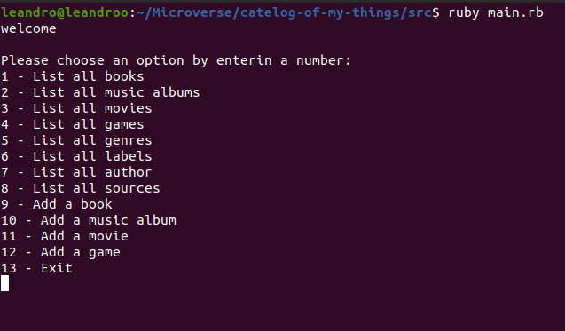
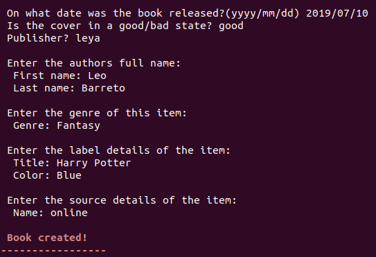
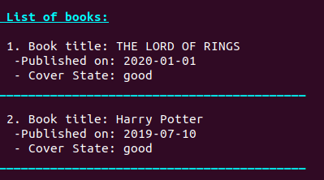

# catelog-of-my-things

> This app that will help you to keep a record of different types of things you won: books, music albums, movies, and games..

> Choose an option:

> Create:

> List:

## Built With

- Ruby

## Test

- Rspec

## Getting Started

To get a local copy up and running follow these simple example steps in your terminal.

- `git clone https://github.com/Hector096/catelog-of-my-things`
- `cd catelog-of-my-things`
- `ruby src/main.rb`

## Authors

👤 **Author 1**

:bearded_person: **Hector**
  - GitHub: [@githubhandle](https://github.com/Hector096)
  - Linkedin: [@linkedinhandle](https://www.linkedin.com/in/hector096/)

👤 **Author 2**

:bearded_person: **Leandro**
  - GitHub: [@Leandro-Barretoo](https://github.com/Leandro-Barretoo)
  - Linkedin: [Leandro Barreto](https://www.linkedin.com/in/leandroobarreto/)
  
👤 **Author 3**

:bearded_person: **AZARIA**
  - GitHub: [@azy64](https://github.com/azy64)
  - Linkedin: [@linkedinhandle](https://www.linkedin.com/in/azaria-saidi-524780112/)

## 🤝 Contributing

Contributions, issues, and feature requests are welcome!

Feel free to check the [issues page](https://github.com/Hector096/catelog-of-my-things/issues).

## Acknowledgements

## Show your support

Give a ⭐️ if you like this project!
